# Nestjs Tutorial

## 1-1. create a new nest project

### use below command to install nestjs

```
npm i -g @nestjs/cli
```

### create a new proejct

```
nest new your-project-name
```

```
✔ Installation in progress... ☕

🚀  Successfully created project my-nestjs-project
👉  Get started with the following commands:
```

### in `terminal`

```
cd your-project-name
npm run start:dev
```

### in browser open `localhost:3000`, if you see below means the server is running


### open `src\app.service.ts`

### add function getCurrentTime in AppService

```ts
getCurrentTime(): string {
    return new Date().toLocaleTimeString();
  }
```

### open `src\app.controller.ts`

### add function getCurrentTime AppController

```ts
  //@Get means use GET method
  //(there are other method: POST, PATCH, PUT, DELETE, OPTIONS, OPTIONS, HEAD, TRACE, CONNECT in http/1.1
  //the string 'getCurrentTime' is the path
  @Get('getCurrentTime')
  getCurrentTime(): string {
    return this.appService.getCurrentTime();
  }
```

### result


### 👍1-1. Finished!!

## 1-2. create DB and table

<!--
## download MS SQL server

### go to https://www.microsoft.com/en-us/sql-server/sql-server-downloads

### run  `SQL2022-SSEI-Dev.exe` for install


## download SQL manager

### go to https://learn.microsoft.com/zh-tw/ssms/download-sql-server-management-studio-ssms#download-ssms


### run  `SSMS-Setup-CHT.exe` for install


### run


### login with windows


### set Server authentication : `SQL Server and Windows Authentication mode`


### restart


### login with
- Authentication: SQL Server Authentication
- Login: sa
- Password: ""
 -->

## download mariaDB (db server) in https://mariadb.com/kb/en/postdownload/mariadb-server-11-4-5/

## download DBeaver (db tools) in https://dbeaver.io/download/

### in DBeaver press `F3` to open new SQL script

`run`: ctrl + enter

`comment`: ctrl + /


```sql
CREATE DATABASE mydb
```

```sql
USE mydb
```

```sql
CREATE TABLE pokemon (
    id INT AUTO_INCREMENT PRIMARY KEY,
    name VARCHAR(50) NOT NULL,
    type1 VARCHAR(20) NOT NULL,
    type2 VARCHAR(20) NULL,
    hp INT NOT NULL,
    attack INT NOT NULL,
    defense INT NOT NULL,
    special_attack INT NOT NULL,
    special_defense INT NOT NULL,
    speed INT NOT NULL,
    total INT GENERATED ALWAYS AS (hp + attack + defense + special_attack + special_defense + speed) STORED,
    created_at TIMESTAMP DEFAULT CURRENT_TIMESTAMP
);
```

```sql
INSERT INTO pokemon (name, type1, type2, hp, attack, defense, special_attack, special_defense, speed)
VALUES
    ('Pikachu', 'Electric', NULL, 35, 55, 40, 50, 50, 90),
    ('Charizard', 'Fire', 'Flying', 78, 84, 78, 109, 85, 100),
    ('Bulbasaur', 'Grass', 'Poison', 45, 49, 49, 65, 65, 45),
    ('Squirtle', 'Water', NULL, 44, 48, 65, 50, 64, 43);
```

```sql
SELECT * from pokemon
```


### 👍1-2. Finished!!

## 1-3. connect DB in nestjs

### install bewlow

```
npm install @nestjs/typeorm typeorm mysql
```

### create typeorm.config.ts

```ts
import { TypeOrmModuleOptions } from '@nestjs/typeorm';

export const typeOrmConfig: TypeOrmModuleOptions = {
  type: 'mariadb', // "mysql, mariadb, postgres, sqlite, mssql, oracle, mongodb"）
  host: process.env.DATABASE_HOST || 'localhost',
  port: Number(process.env.DATABASE_PORT) || 3306,
  username: process.env.DATABASE_USERNAME || 'root',
  password: process.env.DATABASE_PASSWORD || '123456',
  database: process.env.DATABASE_NAME || 'mydb',
  entities: ['dist/**/typeorm-model/*{.ts,.js}'],
  extra: {
    connectionLimit: 10,
  },
};
```

### open src\app.module.ts, add TypeOrmModule in imports

```ts
import { Module } from '@nestjs/common';
import { AppController } from './app.controller';
import { AppService } from './app.service';
import { typeOrmConfig } from './app/base/typeorm/typeorm.config';
import { TypeOrmModule } from '@nestjs/typeorm';

@Module({
  imports: [TypeOrmModule.forRoot(typeOrmConfig)],
  controllers: [AppController],
  providers: [AppService],
})
export class AppModule {}
```

### create pokemonService

```bash
nest g service pokemon
```

### pokemon.service.ts

```ts
import { Injectable } from '@nestjs/common';
import { DataSource } from 'typeorm';

@Injectable()
export class PokemonService {
  constructor(private readonly dataSource: DataSource) {}

  async getAllPokemon() {
    return this.dataSource.query('SELECT * FROM pokemon');
  }
}
```

### create pokemonController

```bash
nest g controller pokemon
```

### pokemon.controller.ts

```ts
import { Controller, Get } from '@nestjs/common';
import { PokemonService } from './pokemon.service';

@Controller('pokemon')
export class PokemonController {
  constructor(private readonly pokemonService: PokemonService) {}

  @Get('list')
  getAllPokemon() {
    return this.pokemonService.getAllPokemon();
  }
}
```

### create pokemonModule

```bash
nest g mo pokemon
```

### pokemon.module.ts

```ts
import { Module } from '@nestjs/common';
import { PokemonService } from './pokemon.service';
import { PokemonController } from './pokemon.controller';

@Module({
  imports: [],
  providers: [PokemonService],
  controllers: [PokemonController],
})
export class PokemonModule {}
```

### add `PokemonModule` in `app.module.ts` imports

### open browser connect to http://localhost:3000/pokemon/list


### 👍1-3. Finished!!

# Why sould we use orm?


https://medium.com/@kadergenc/what-is-orm-why-is-it-used-what-are-its-pros-and-cons-3ed77c0e6ed2

## 2-1.entities gen

### terminal

```bash
npm install typeorm-model-generator
```

### open `package.json` add below in `scripts`

### and i use `typeorm-model` as [output folder name]

```json
"scripts": {
    //...
    "ent-gen": "rm -rf [output folder name] & typeorm-model-generator -h localhost -d mydb -u root -x 123456 -e mariadb -o [output folder name] --noConfig true"
    }
```

- `rm -rf [output folder name]` delete folder before gen

### more info https://www.npmjs.com/package/typeorm-model-generator/v/0.3.1#usage

### terminal

```
npm run ent-gen
```

### ✨✨result✨✨


### make sure the entities path in `typeorm.config.ts` is match `[output folder name]`

```ts
entities: ['dist/**/typeorm-model/*{.ts,.js}'],
```

### 👍2-1. Finished!!

## 2-2. Create, Read, Update, Delete (CRUD) via orm

### in pokemon service, you can use find, findOne, create, remove methods in repository.

```ts
  async find(): Promise<Pokemon[] | null> {
    const res = await this.pokemonRepository.find();

    return res;
  }

  async findOne(id: number): Promise<Pokemon | null> {
    const res = await this.pokemonRepository.findOne({ where: { id: id } });

    return res;
  }

  async create(data: Partial<Pokemon>): Promise<Pokemon> {
    const newPokemon = this.pokemonRepository.create(data);
    return await this.pokemonRepository.save(newPokemon);
  }

  async update(id: number, data: Partial<Pokemon>): Promise<Pokemon | null> {
    await this.pokemonRepository.update(id, data);
    return this.findOne(id);
  }

  async remove(id: number): Promise<void> {
    await this.pokemonRepository.delete(id);
  }
```

### in pokemon controller

```ts
  // http://localhost:3000/pokemon/list
  @Post('list')
  findAllPokemon(): Promise<Pokemon[] | null> {
    return this.pokemonService.find();
  }

  // http://localhost:3000/pokemon/findOne
  @Post('findOne')
  findOnePokemon(@Body() data: Partial<Pokemon>): Promise<Pokemon> {
    return this.pokemonService.findOne(data.id);
  }

  // http://localhost:3000/pokemon/create
  @Post('create')
  createPokemon(@Body() data: Partial<Pokemon>): Promise<Pokemon> {
    return this.pokemonService.create(data);
  }

  // http://localhost:3000/pokemon/update
  @Post('update')
  updatePokemon(@Body() data: Partial<Pokemon>): Promise<UpdateResult> {

    if (!data.id) {
      throw new BadRequestException('id required!');
    }

    return this.pokemonService.update(data.id, data);
  }

  // http://localhost:3000/pokemon/delete
  @Post('delete')
  deletePokemon(@Body() data: Partial<Pokemon>): Promise<DeleteResult> {

    if (!data.id) {
      throw new BadRequestException('id required!');
    }

    return this.pokemonService.remove(data.id);
  }
```

| Operation      | RESTful API            | RPC API                                                                         |
| -------------- | ---------------------- | ------------------------------------------------------------------------------- |
| Get Pokémon    | `GET /pokemon/{id}`    | `POST getPokemonInfo({ "pokemonId": 1 })`                                       |
| Create Pokémon | `POST /pokemon`        | `POST createPokemon({ "name": "Charmander", "type": "Fire" })`                  |
| Update Pokémon | `PATCH /pokemon/{id}`  | `POST updatePokemon({ "pokemonId": 1, "name": "Pikachu", "type": "Electric" })` |
| Delete Pokémon | `DELETE /pokemon/{id}` | `POST deletePokemon({ "pokemonId": 1 })`                                        |

### those method is not GET, and you need to use some rest api tool (eg.postman) to test it, I will use a chrome extension `Talend API Tester - Free Edition`

### go https://chromewebstore.google.com/detail/talend-api-tester-free-ed/aejoelaoggembcahagimdiliamlcdmfm

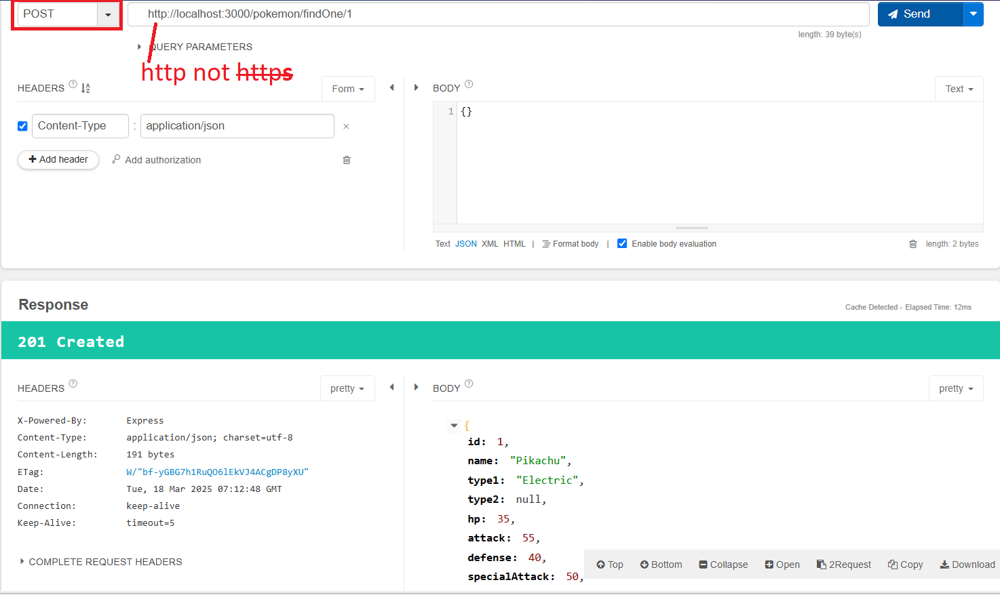
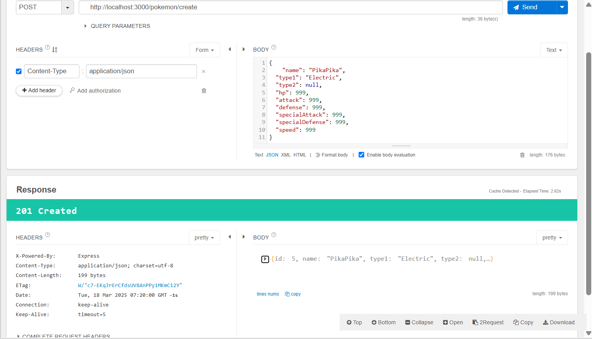

### 👍2-2. Finished!!

## 2-3. class-validation

### In the previous example, we successfully created a Pokémon. But what if the request data is incorrect?

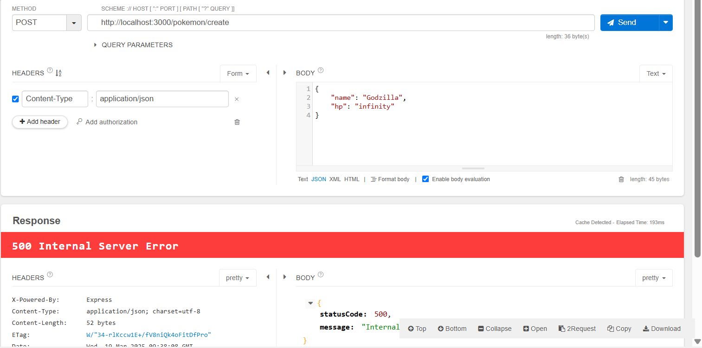

### We send this invalid data to the backend, and the backend directly passes it to the database without any handling, which results in the errors shown below in the console.

```bash
  code: 'ER_TRUNCATED_WRONG_VALUE_FOR_FIELD',
  sqlMessage: "Incorrect integer value: 'infinity' for column `mydb`.`pokemon`.`attack` at row 1",
```

### The database rejects your invalid data, but the database is a critical resource, meaning the data should be rejected before it reaches the database. For basic validation, we can implement this in our DTO.

```plaintext
Frontend
   │
   ▼
  DTO  ←→  Basic Validation
   │
   ▼
Controller
   │
   ▼
Service ←→ Business Logic Validation
   │
   ▼
Repository
   │
   ▼
Entity
   │
   ▼
Database
```

```bash
npm install class-validator class-transformer
```

### create /base/validation/validation.pipe.ts

```ts
import { BadRequestException, ValidationPipe } from '@nestjs/common';

export const dtoValidationPipe = new ValidationPipe({
  whitelist: true, // Automatically filters out properties not defined in the DTO.
  // forbidNonWhitelisted: true, // Throws an error when encountering properties that are not defined.
  transform: true, // Automatically transforms the payload into the DTO class (equivalent to plainToClass()).
  exceptionFactory: (errors) => {
    const validationErrors = errors.reduce(
      (acc, error) => {
        acc[error.property] = Object.values(error.constraints || {});
        return acc;
      },
      {} as Record<string, string[]>,
    );

    return new BadRequestException({
      statusCode: 400,
      message: 'Validation failed',
      validationErrors,
    });
  },
});
```

### apply it in main.ts

```ts
import { NestFactory } from '@nestjs/core';
import { AppModule } from './app.module';
import { dtoValidationPipe } from './app/base/validation/validation.pipe';

async function bootstrap() {
  const app = await NestFactory.create(AppModule);

  // HERE
  app.useGlobalPipes(dtoValidationPipe);

  await app.listen(process.env.PORT ?? 3000);
}
bootstrap();
```

### create pokemon.dto.ts

```ts
import { IsInt, IsNotEmpty, IsPositive, IsString, Min } from 'class-validator';

const MIN_ATTACK = 0;

export class CreatePokemonRequest {
  @IsString({ message: 'Must be a string' })
  name: string;

  @IsNotEmpty()
  @IsString({ message: 'Must be a string' })
  type1: string;

  @IsString({ message: 'Must be a string' })
  type2: string | null;

  @IsInt({ message: 'Must be an integer' })
  @IsPositive({ message: 'Must be a positive number (> 0)' })
  hp: number;

  @Min(MIN_ATTACK, { message: `Must be ≥ ${MIN_ATTACK}` })
  @IsInt()
  attack: number;

  @IsInt()
  defense: number;

  @IsInt()
  specialAttack: number;

  @IsInt()
  specialDefense: number;

  @IsInt()
  speed: number;
}
```

### open pokemon.controller.ts, apply CreatePokemonRequest

```ts
  // http://localhost:3000/pokemon/create
  @Post('create')
  async createPokemon(@Body() data: CreatePokemonRequest): Promise<Pokemon> {
    return this.pokemonService.create(data);
  }
```

### Test again, the API responds below, and it works!!

```json
{
  "statusCode": 400,
  "message": "Validation failed",
  "validationErrors": {
    "type1": ["Must be a string", "type1 should not be empty"],
    "type2": ["Must be a string"],
    "hp": ["Must be a positive number (> 0)", "Must be an integer"],
    "attack": ["attack must be an integer number", "Must be ≥ 0"],
    "defense": ["defense must be an integer number"],
    "specialAttack": ["specialAttack must be an integer number"],
    "specialDefense": ["specialDefense must be an integer number"],
    "speed": ["speed must be an integer number"]
  }
}
```
### class-validator provides many validation decorators, below are some common categories and corresponding decorators:

```ts

📌 Common Basic Validations
Decorator    Function
@IsString()  Must be a string
@IsInt()     Must be an integer
@IsBoolean() Must be a boolean
@IsNumber()  Must be a number (can be a decimal)
@IsOptional() Allows the field to be undefined or null (no further validation)
@IsNotEmpty() Cannot be empty ("" , null , undefined)
@IsDefined() Must exist (cannot be undefined)

📌 Numeric Validations
Decorator    Function
@IsPositive() Must be a positive number
@IsNegative() Must be a negative number
@Min(value)  Must be >= value
@Max(value)  Must be <= value

📌 String Length Validations
Decorator      Function
@MinLength(value)  Minimum length of string
@MaxLength(value)  Maximum length of string

📌 Boolean Validations
Decorator    Function
@IsBoolean() Must be true or false

📌 Date Validations
Decorator     Function
@IsDate()     Must be a Date type
@MinDate(date) Must be >= date
@MaxDate(date) Must be <= date

📌 Array Validations
Decorator       Function
@IsArray()      Must be an array
@ArrayMinSize(value) Minimum length of array
@ArrayMaxSize(value) Maximum length of array
@ArrayNotEmpty() Array cannot be empty
@ArrayUnique()  Values in array must be unique

📌 Email & URL Validations
Decorator    Function
@IsEmail()   Must be in Email format
@IsUrl()     Must be in URL format
@IsFQDN()    Must be a Fully Qualified Domain Name
@IsIP(version?) Must be an IP address (can specify version 4 or 6)

📌 Other Format Validations
Decorator        Function
@IsUUID(version?) Must be a UUID (can specify version 1, 3, 4, 5)
@IsCreditCard()  Must be a credit card number
@IsHexColor()    Must be a Hex color code
@IsMACAddress()  Must be a MAC address
@IsPostalCode(locale?) Must be a postal code
@IsPhoneNumber(region?) Must be a phone number

📌 Custom Validations
Decorator           Function
@Matches(regex)     Must match the regular expression
@Validate(CustomValidator) Uses custom validation logic

📌 Example (using regular expression to validate password)

ts
import { Matches } from 'class-validator';

class UserDto {
  @Matches(/^(?=.*\d)(?=.*[a-z])(?=.*[A-Z]).{8,}$/)
  password: string;
}

📌 Example (using custom validation)

ts
import { ValidatorConstraint, ValidatorConstraintInterface, Validate } from 'class-validator';

// Custom validation logic
@ValidatorConstraint({ async: false })
export class IsUsernameUnique implements ValidatorConstraintInterface {
  validate(username: string) {
    return username !== 'admin'; // Assume admin cannot be used
  }

  defaultMessage() {
    return 'Username is already taken!';
  }
}

// Using custom validation
class UserDto {
  @Validate(IsUsernameUnique)
  username: string;
}
```

### 👍2-3. Finished!!

## 2-4. Automatically add class-validator based on TypeORM rules

### In `[2-1.entities gen]`, we generated entities automatically. Logically, our validation should not conflict with the rules in the entity, so we can definitely clone the rules from it.

```ts
@Entity("pokemon", { schema: "mydb" })
export class Pokemon {
  @PrimaryGeneratedColumn({ type: "int", name: "id" })
  id: number;

  @Column("varchar", { name: "name", length: 50 })
  name: string;

  @Column("varchar", { name: "type1", length: 20 })
  type1: string;

  ...

  @Column("timestamp", {
    name: "created_at",
    nullable: true,
    default: () => "CURRENT_TIMESTAMP",
  })
  createdAt: Date | null;
}
```


### create validate-from-entity.decorators
```ts
import {
  IsEmail,
  IsInt,
  IsNotEmpty,
  IsOptional,
  IsString,
  MaxLength,
} from 'class-validator';
import { getMetadataArgsStorage } from 'typeorm';

export function ValidateFromEntity(entity: Function, property?: string) {
  return function (target: any, key: string) {
    const columnName = property ?? key; // 👉 If no second parameter is provided, it defaults to the property name

    const columns = getMetadataArgsStorage().columns.filter(
      (col) => col.target === entity && col.propertyName === columnName,
    );

    if (columns.length === 0) return; // If no matching column is found, return immediately

    const options = columns[0].options;
    const decorators: PropertyDecorator[] = [];

    // 🔹 Automatically add class-validator validation based on TypeORM rules
    if (options.length !== undefined)
      decorators.push(MaxLength(+options.length));
    if (options.nullable) decorators.push(IsOptional());
    else decorators.push(IsNotEmpty());
    if (options.type === 'varchar') decorators.push(IsString());
    if (options.type === 'int') decorators.push(IsInt());
    if (options.unique) decorators.push(IsNotEmpty());
    if (columnName.includes('email')) decorators.push(IsEmail());

    // 🚀 Correctly apply the decorators
    Reflect.decorate(decorators, target, key);
  };
}
```

### in dto
```ts
  import { ValidateFromEntity } from 'src/app/base/validation/validate-from-entity.decorators';
```

### original
```ts
  @IsInt({ message:"Must be an integer" })
  @IsPositive({ message:"Must be a positive number (> 0)" })
  hp: number;
```

### remove ~~@IsInt({ message:"Must be an integer" })~~ & ~~@IsPositive({ message:"Must be a positive number (> 0)" })~~, and add `@ValidateFromEntity(Pokemon)`

### result
```ts
  @ValidateFromEntity(Pokemon)
  hp: number;
```

### If you have validation rules that are not based on the entity, just add them. Don't worry if the rule `conflicts` with the entity; `class-validator` will follow all the rules.

## Example 

```ts
  @Column("varchar", { name: "name", length: 50 })
  name: string;
```

The `entity`'s maximum length is 50, but you need it to be 30 in the `DTO`. Just add @MaxLength(30) as shown before. The concept is that the value must pass all the rules (maxLength 30 && maxLength 50).

```ts
  @ValidateFromEntity(Pokemon) //maxlength: 50
  @MaxLength(30)
  name: string;
```

## 2-5. swagger-ui

```bash
npm install @nestjs/swagger
```

### create config.ts file
```ts
import { INestApplication } from '@nestjs/common';
import { DocumentBuilder, SwaggerModule } from '@nestjs/swagger';
import { writeFileSync } from 'fs';
import { join } from 'path';

export function setupSwagger(app: INestApplication) {

  const config = new DocumentBuilder()
    .setTitle('Pokemon API')
    .setVersion('1.0')
    .build();

  const document = SwaggerModule.createDocument(app, config);
  SwaggerModule.setup('swagger-ui', app, document); // Swagger UI route path

}
```

### open main.ts, add `setupSwagger(app)` before `await app.listen(process.env.PORT ?? 3000);`

```ts
  ...

  setupSwagger(app)

  await app.listen(process.env.PORT ?? 3000);
```

### open http://localhost:3000/swagger-ui

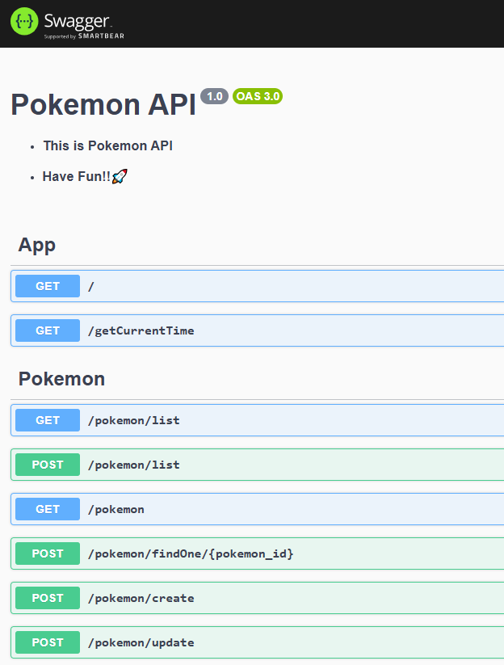

### 👍2-5. Finished!!

## 2.6 Add example and schema

### it's works, but the example and schema is empty....

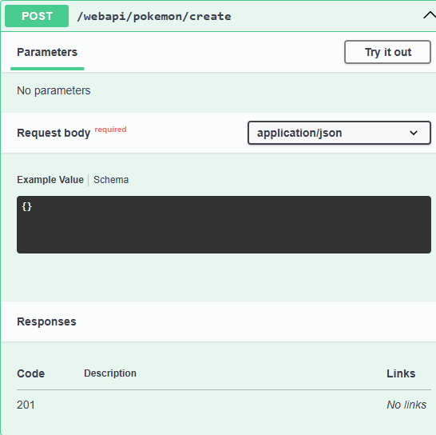

### open pokemon.dto.ts

```ts
import { ApiProperty } from '@nestjs/swagger';
```

### add on all fields

```ts
  @ApiProperty({ example: 'super monster', description: 'pokemon name' })
  @ValidateFromEntity(Pokemon)
  name: string;
```

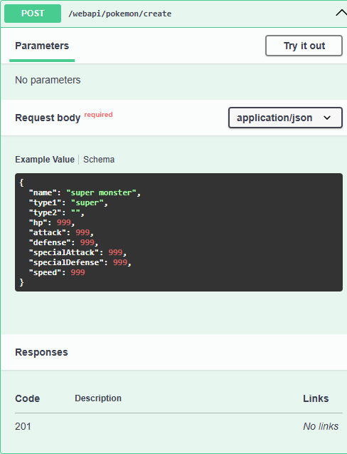

### Creating a new Pokémon 🦖 using Swagger UI

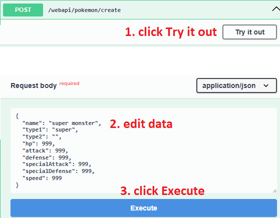

### Use the list API to confirm the Pokémon was created

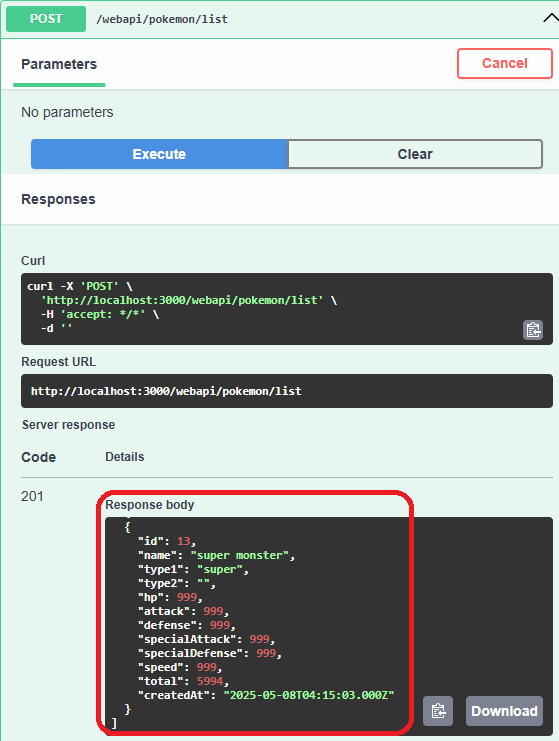


### 🦖🦖🦖2-6. Finished!!🦖🦖🦖

## 2-7. Add basePath and download link of openapi.json

### edit main.ts, add `app.setGlobalPrefix('webapi')`

```ts
  const app = await NestFactory.create(AppModule);

  // Please call setGlobalPrefix as early as possible, otherwise some functions might not recognize the prefix.
  app.setGlobalPrefix('webapi');
```

### edit config.ts file, add `setDescription(markdown string)`, and generate the static openapi.json file.
```ts

export function setupSwagger(app: INestApplication) {

  const config = new DocumentBuilder()
    .setTitle('Pokemon API')
    //↓↓↓↓↓↓↓↓↓↓↓
    // add download link
    .setDescription(
      '- ### This is Pokemon API        \n- ### [swagger.json](/swagger.json)        \n- ### Have Fun!!🚀',
    )
    //↑↑↑↑↑↑↑↑↑↑↑
    .setVersion('1.0')
    .build();

  ...

  // generate Swagger JSON as static file
  const swaggerJsonPath = join(process.cwd(), 'swagger.json');
  writeFileSync(swaggerJsonPath, JSON.stringify(document, null, 2));

  // Expose the raw OpenAPI JSON file at /swagger.json
  // This allows tools or users to fetch the spec directly (e.g. Swagger UI, Postman)
  app.getHttpAdapter().get('/swagger.json', (req, res) => {
    res.sendFile(swaggerJsonPath);
  });
}
```

### go http://localhost:3000/swagger.json check this json

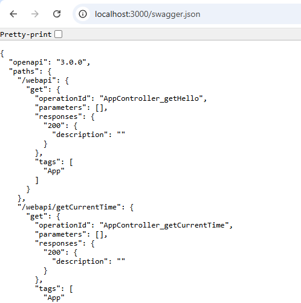

### 👍2-7. Finished!!

## 2-8. add global 

## 3-1. create users table and regist api

```sql
CREATE TABLE users (
  id INT NOT NULL AUTO_INCREMENT,
  email VARCHAR(255) NOT NULL,
  username VARCHAR(100) NOT NULL,
  password VARCHAR(255) DEFAULT NULL,
  status VARCHAR(10) DEFAULT 'inactive',
  role ENUM('admin', 'user', 'guest') NOT NULL DEFAULT 'user',
  created_at DATETIME DEFAULT CURRENT_TIMESTAMP,
  updated_at DATETIME DEFAULT CURRENT_TIMESTAMP,
  password_updated_at DATETIME DEFAULT NULL,
  refresh_token VARCHAR(255) DEFAULT NULL,
  ip VARCHAR(45) DEFAULT NULL,
  PRIMARY KEY (id),
  UNIQUE KEY email (email)
)
```

### gen entity

### create users.dto.ts

```ts
import { ValidateFromEntity } from 'src/app/base/validation/validate-from-entity.decorators';
import { Users } from 'typeorm-model/Users';
import { ApiProperty } from '@nestjs/swagger';

export class RegisterRequest {

  @ApiProperty({ example: 'example@example.com', description: 'email' })
  @ValidateFromEntity(Users)
  email: string;

  @ApiProperty({ example: 'exampleUsername', description: 'username' })
  @ValidateFromEntity(Users)
  username: string;
  
  @ApiProperty({ example: 'examplePassword', description: 'password' })
  @ValidateFromEntity(Users)
  password: string;

}
```

### create users.service.ts, PLEASE read comment

```ts
import { Injectable } from '@nestjs/common';
import { InjectRepository } from '@nestjs/typeorm';
import { Repository } from 'typeorm';
import { Users } from 'typeorm-model/Users';
import * as bcrypt from 'bcrypt';

const SALT_ROUNDS = 10;

@Injectable()
export class UsersService {
  constructor(
    @InjectRepository(Users)
    private readonly usersRepository: Repository<Users>,
  ) {}

  async register(data: Partial<Users>):Promise<Users> {

    // Securely hash the plain password using bcrypt to prevent storing raw passwords in the database
    const hashedPassword = await bcrypt.hash(data.password, SALT_ROUNDS);

    data.password = hashedPassword;

    const newData = this.usersRepository.create(data);
    return await this.usersRepository.save(newData);
  }
}
```

### create users.controller.ts

```ts
import {
  Body,
  Controller,
  Post,
} from '@nestjs/common';
import { UsersService } from './users.service';
import { RegisterRequest } from './users.dto';
import { Users } from 'typeorm-model/Users';

@Controller('users')
export class UsersController {
  constructor(private readonly usersService: UsersService) {}

  // http://localhost:3000/user/register
  @Post('register')
  @UsePipes(new ValidationPipe({ whitelist: true })) // !!! Removes unexpected fields not defined in the DTO
  async register(@Body() data: RegisterRequest): Promise<Users> {
    return this.usersService.register(data);
  }
}
```

### create users.module.ts

```ts
import { Module } from '@nestjs/common';
import { UsersService } from './users.service';
import { UsersController } from './users.controller';
import { TypeOrmModule } from '@nestjs/typeorm';
import { Users } from 'typeorm-model/Users';

@Module({
  imports: [TypeOrmModule.forFeature([Users])],
  providers: [UsersService],
  controllers: [UsersController],
})
export class UsersModule {}
```

### append UsersModule in imports of app.module.ts

### Creating a new User 🧑 using Swagger UI

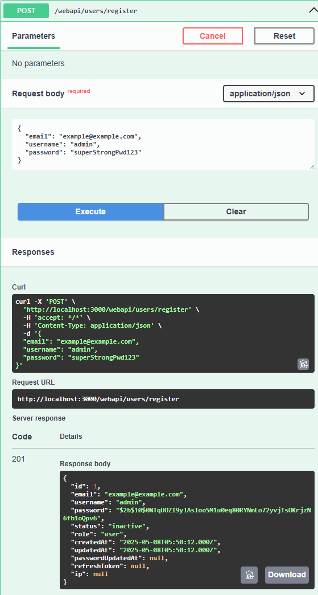

#### ※ A future tutorial will include a step to ensure the user registering owns the provided email address

### Open your DB tool (like DBeaver) and manually approve the registration

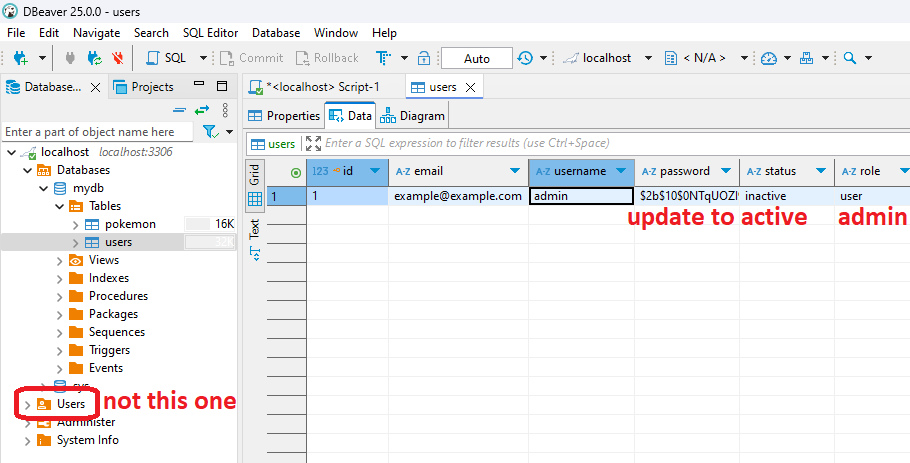

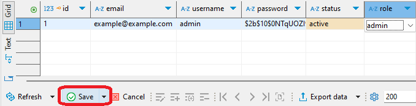

### 🧑🧑🧑3-1. Finished!!🧑🧑🧑

## 3-2. login api

### These are the main steps of a login API:
- `Step 1`: Find the user by username and verify the password.

- `Step 2`: Generate and return a JWT token as the response.

### first of all, create /login api in controller and login function in service

```bash
npm install @nestjs/jwt @nestjs/passport passport-jwt
```

## 3-3. Add user status check

### In the previous step, we created a login API. However, we did not check if the user's account is active. In this step, we will add a check to ensure that only active users can log in.

### open `src/app/feature/user/users.service.ts` and add the status check in the `login` function.

```typescript
// src/app/feature/user/users.service.ts

  async login(data: LoginRequest): Promise<{ accessToken: string; refreshToken: string }> {

    const user = await this.usersRepository.findOne({ where: { username: data.username}});

    // user not exist or wrong password
    if (!user || !(await bcrypt.compare(data.password, user.password))) {
      throw new HttpException(
        'ERROR_CODES.UNAUTHORIZED',
        401,
      );
    }

    // if status is not "active"
    if (user.status !== 'active') {
      throw new HttpException('Account is not active', 401);
    }

    const payload = { username: user.username, role: user.role };
    //...
  }
```

### Now, if a user with an inactive status tries to log in, they will receive a 401 Unauthorized error with the message 'Account is not active'. This is a more general message that covers any non-active state, including inactive or banned accounts.

### To test this, you can try to log in with the user you created in step 3-1, which has an 'inactive' status by default.

### 👍3-3. Finished!!


## download / upload / virus scan / media stream

## auth

## email

## transaction

## websocket

## third-party
