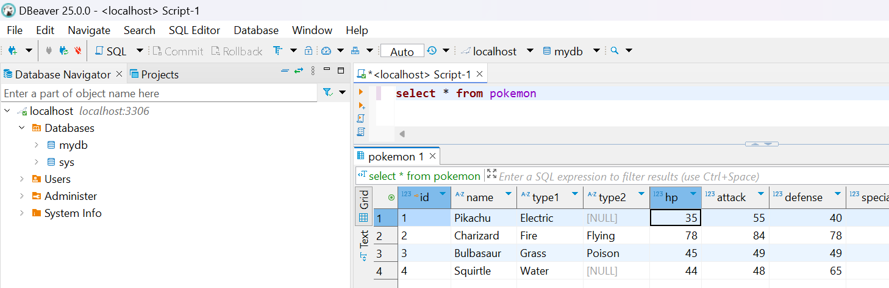
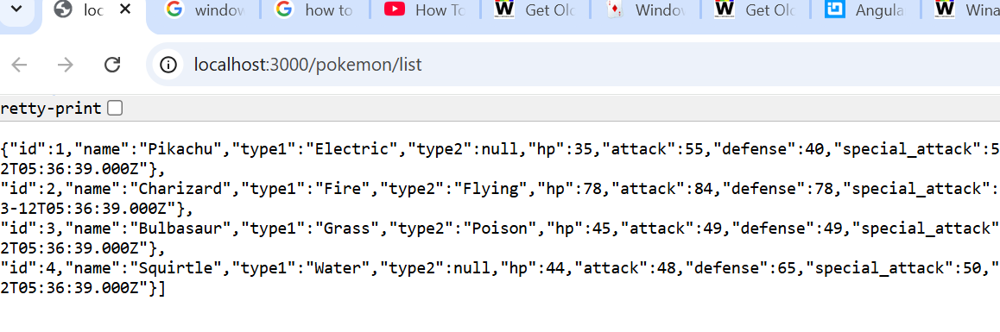
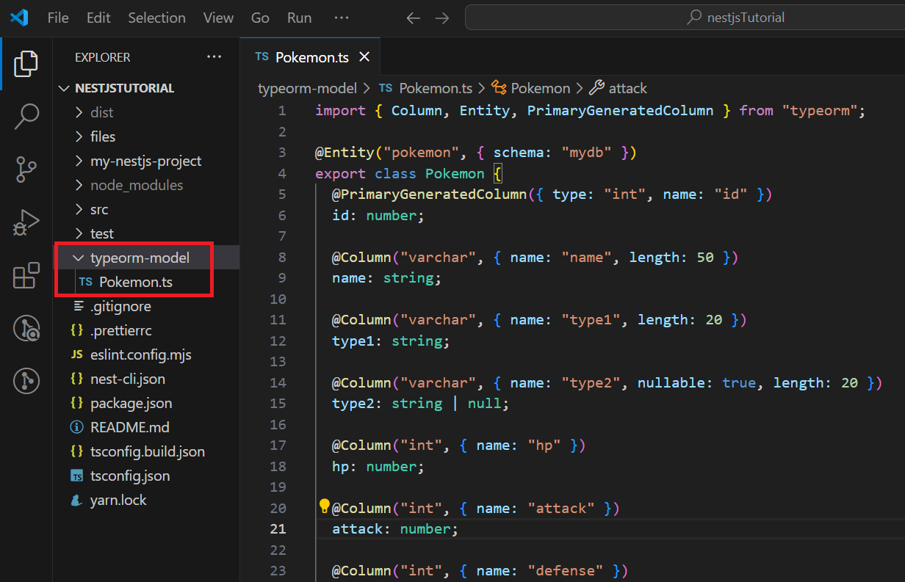

# Nestjs Tutorial

## 1-1. create a new nest project
### use below command to install nestjs
```
npm i -g @nestjs/cli
```

### create a new proejct
```
nest new your-project-name
```

```
✔ Installation in progress... ☕

🚀  Successfully created project my-nestjs-project
👉  Get started with the following commands:
```

### in `terminal`
```
cd your-project-name
npm run start:dev
```

### in browser open `localhost:3000`, if you see below means the server is running


### open `src\app.service.ts`
### add function getCurrentTime in AppService

```ts
getCurrentTime(): string {
    return new Date().toLocaleTimeString();
  }
```

### open `src\app.controller.ts`
### add function getCurrentTime AppController
```ts
  //@Get means use get method in restful api, there are other method: post, put ...etc, the string 'getCurrentTime' is the path
  @Get('getCurrentTime') 
  getCurrentTime(): string {
    return this.appService.getCurrentTime();
  }
```

### result


### 👍1-1. Finished!!

## 1-2. create DB and table

<!-- 
## download MS SQL server

### go to https://www.microsoft.com/en-us/sql-server/sql-server-downloads

### run  `SQL2022-SSEI-Dev.exe` for install


## download SQL manager

### go to https://learn.microsoft.com/zh-tw/ssms/download-sql-server-management-studio-ssms#download-ssms


### run  `SSMS-Setup-CHT.exe` for install


### run


### login with windows


### set Server authentication : `SQL Server and Windows Authentication mode`


### restart


### login with
- Authentication: SQL Server Authentication
- Login: sa
- Password: ""
 -->

## download mariaDB (db server) in https://mariadb.com/kb/en/postdownload/mariadb-server-11-4-5/

## download DBeaver (db tools) in https://dbeaver.io/download/

### in DBeaver press `F3` to open new SQL script
`run`: ctrl + enter

`comment`: ctrl + /


```sql
CREATE DATABASE mydb
```

```sql
USE mydb
```

```sql
CREATE TABLE pokemon (
    id INT AUTO_INCREMENT PRIMARY KEY,
    name VARCHAR(50) NOT NULL,
    type1 VARCHAR(20) NOT NULL,
    type2 VARCHAR(20) NULL,
    hp INT NOT NULL,
    attack INT NOT NULL,
    defense INT NOT NULL,
    special_attack INT NOT NULL,
    special_defense INT NOT NULL,
    speed INT NOT NULL,
    total INT GENERATED ALWAYS AS (hp + attack + defense + special_attack + special_defense + speed) STORED,
    created_at TIMESTAMP DEFAULT CURRENT_TIMESTAMP
);
```

```sql
INSERT INTO pokemon (name, type1, type2, hp, attack, defense, special_attack, special_defense, speed)
VALUES 
    ('Pikachu', 'Electric', NULL, 35, 55, 40, 50, 50, 90),
    ('Charizard', 'Fire', 'Flying', 78, 84, 78, 109, 85, 100),
    ('Bulbasaur', 'Grass', 'Poison', 45, 49, 49, 65, 65, 45),
    ('Squirtle', 'Water', NULL, 44, 48, 65, 50, 64, 43);
```

```sql
SELECT * from pokemon
```



### 👍1-2. Finished!!

## 1-3. connect DB in nestjs

### install bewlow
```
npm install @nestjs/typeorm typeorm mysql
```

### create typeorm.config.ts
```ts
import { TypeOrmModuleOptions } from '@nestjs/typeorm';

export const typeOrmConfig: TypeOrmModuleOptions = {
  type: 'mariadb', // "mysql, mariadb, postgres, sqlite, mssql, oracle, mongodb"）
  host: process.env.DATABASE_HOST || 'localhost',
  port: Number(process.env.DATABASE_PORT) || 3306,
  username: process.env.DATABASE_USERNAME || 'root',
  password: process.env.DATABASE_PASSWORD || '123456',
  database: process.env.DATABASE_NAME || 'mydb',
  entities: ['dist/**/typeorm-model/*{.ts,.js}'],
  extra: {
    connectionLimit: 10
  },
};
```

### open src\app.module.ts, add TypeOrmModule in imports 
```ts
import { Module } from '@nestjs/common';
import { AppController } from './app.controller';
import { AppService } from './app.service';
import { typeOrmConfig } from './app/base/typeorm/typeorm.config';
import { TypeOrmModule } from '@nestjs/typeorm';

@Module({
  imports: [TypeOrmModule.forRoot(typeOrmConfig),],
  controllers: [AppController],
  providers: [AppService],
})
export class AppModule {}
```

### create pokemonService

```bash
nest g service pokemon
```

### pokemon.service.ts
```ts
import { Injectable } from '@nestjs/common';
import { DataSource } from 'typeorm';

@Injectable()
export class PokemonService {
  constructor(private readonly dataSource: DataSource) {}

  async getAllPokemon() {
    return this.dataSource.query('SELECT * FROM pokemon');
  }
}
```

### create pokemonController 
```bash
nest g controller pokemon
```

### pokemon.controller.ts
```ts
import { Controller, Get } from '@nestjs/common';
import { PokemonService } from './pokemon.service';

@Controller('pokemon')
export class PokemonController {
  constructor(private readonly pokemonService: PokemonService) {}

  @Get('list')
  getAllPokemon() {
    return this.pokemonService.getAllPokemon()
  }
}
```

### create pokemonModule

```bash
nest g mo pokemon
```

### pokemon.module.ts
```ts
import { Module } from '@nestjs/common';
import { PokemonService } from './pokemon.service';
import { PokemonController } from './pokemon.controller';

@Module({
  imports: [],
  providers: [PokemonService],
  controllers: [PokemonController],
})
export class PokemonModule {}
```

### add `PokemonModule` in `app.module.ts` imports

### open browser connect to http://localhost:3000/pokemon/list



### 👍1-3. Finished!!

## 2-1.entities gen

### terminal
```bash
npm install typeorm-model-generator
```

open `package.json` add below in `scripts`

```json
"scripts": {
    //...
    "ent-gen": "rm -rf typeorm-model & typeorm-model-generator -h localhost -d mydb -u root -x 123456 -e mariadb -o typeorm-model --noConfig true"
    }
```

* `rm -rf [output folder name]` delete folder before gen

### more info https://www.npmjs.com/package/typeorm-model-generator/v/0.3.1#usage

### terminal
```
npm run ent-gen
```

### ✨✨result✨✨



### 👍2-1. Finished!!

## download / upload / virus scan / media stream
## swagger
## auth
## class-validation
## email
## transaction
## websocket
## third-party
