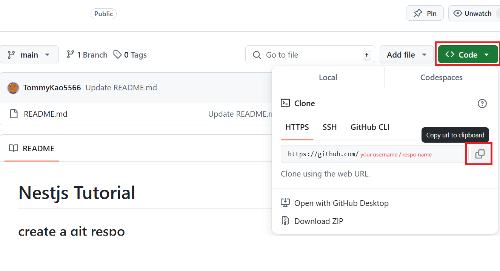

# Nestjs Tutorial

## create a git respo
### login `github` 
### go to https://github.com/new
### fill your `Repository name` (The repository name can only contain ASCII letters, digits, and the characters ., -, and _.)
### check `Add a README file`
### click the `Create respository` button
### open `vscode` -> `terminal`

### type below to clone your project
```
git clone https://github.com/your username/your respo name.git
```

### you can find it in here


## create a new nest project and add LOG
### use below command to install nestjs
```
npm i -g @nestjs/cli
```
### or
```
yarn global add @nestjs/cli
```

### create a new proejct
```
yarn nest new your-project-name
```

```
✔ Installation in progress... ☕

🚀  Successfully created project my-nestjs-project
👉  Get started with the following commands:

$ cd your-project-name
$ yarn run start
```

## create DB and connect and use basic sql to get data
## type orm, gen entities
## download / upload
## swagger
## auth
## calss-validation
## transaction
## websocket
## third-party


$ npm i -g @nestjs/cli
$ nest new project-name