# Nestjs Tutorial

## 1. create a new nest project and add LOG
### use below command to install nestjs
```
npm i -g @nestjs/cli
```

### create a new proejct
```
npm nest new your-project-name
```

```
✔ Installation in progress... ☕

🚀  Successfully created project my-nestjs-project
👉  Get started with the following commands:
```

### in `terminal`
```
cd your-project-name
npm run start:dev
```

### in browser open `localhost:3000`, if you see below means the server is running
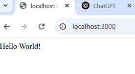

### open `src\app.service.ts`
### add function getCurrentTime in AppService

```ts
getCurrentTime(): string {
    return new Date().toLocaleTimeString();
  }
```

### open `src\app.controller.ts`
### add function getCurrentTime AppController
```ts
  //@Get means use get method in restful api, there are other method: post, put ...etc, the string 'getCurrentTime' is the path
  @Get('getCurrentTime') 
  getCurrentTime(): string {
    return this.appService.getCurrentTime();
  }
```

### result
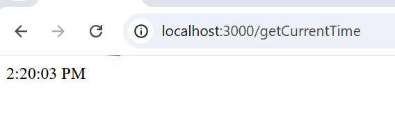

## create DB and connect and use basic sql to get data

## download mariaDB in https://mariadb.com/kb/en/postdownload/mariadb-server-11-4-5/

## download DBeaver in https://dbeaver.io/download/

```sql
CREATE DATABASE pokemon
```

```sql
USE pokemon
```

```sql
CREATE TABLE pokemon (
    id INT AUTO_INCREMENT PRIMARY KEY,
    name VARCHAR(50) NOT NULL,
    type1 VARCHAR(20) NOT NULL,
    type2 VARCHAR(20) NULL,
    hp INT NOT NULL,
    attack INT NOT NULL,
    defense INT NOT NULL,
    special_attack INT NOT NULL,
    special_defense INT NOT NULL,
    speed INT NOT NULL,
    total INT GENERATED ALWAYS AS (hp + attack + defense + special_attack + special_defense + speed) STORED,
    created_at TIMESTAMP DEFAULT CURRENT_TIMESTAMP
);
```

```sql
INSERT INTO pokemon (name, type1, type2, hp, attack, defense, special_attack, special_defense, speed)
VALUES 
    ('Pikachu', 'Electric', NULL, 35, 55, 40, 50, 50, 90),
    ('Charizard', 'Fire', 'Flying', 78, 84, 78, 109, 85, 100),
    ('Bulbasaur', 'Grass', 'Poison', 45, 49, 49, 65, 65, 45),
    ('Squirtle', 'Water', NULL, 44, 48, 65, 50, 64, 43);
```

<!-- 
## download MS SQL server

### go to https://www.microsoft.com/en-us/sql-server/sql-server-downloads

### run  `SQL2022-SSEI-Dev.exe` for install

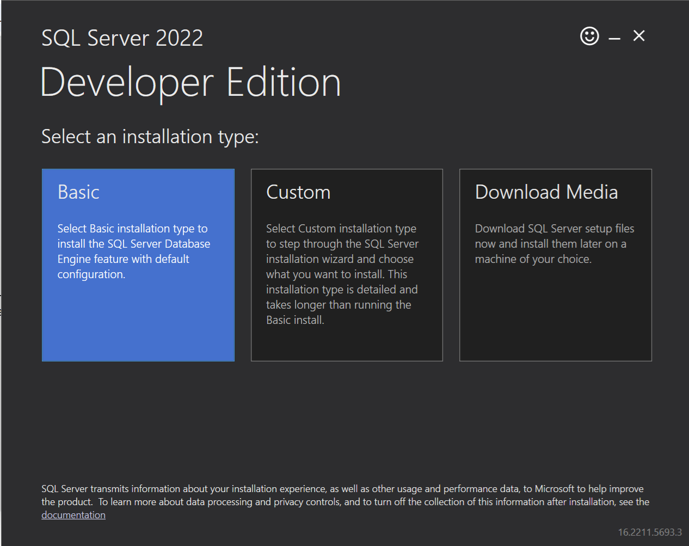
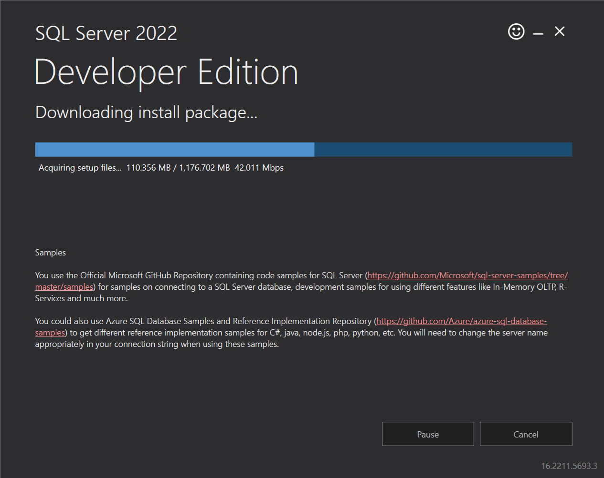
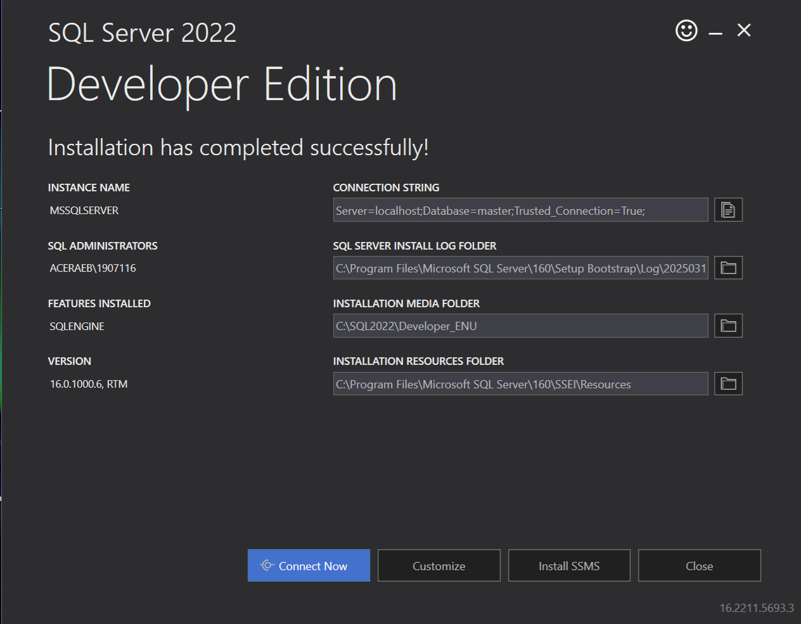
## download SQL manager

### go to https://learn.microsoft.com/zh-tw/ssms/download-sql-server-management-studio-ssms#download-ssms

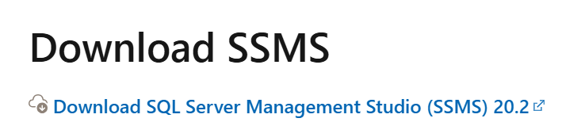

### run  `SSMS-Setup-CHT.exe` for install

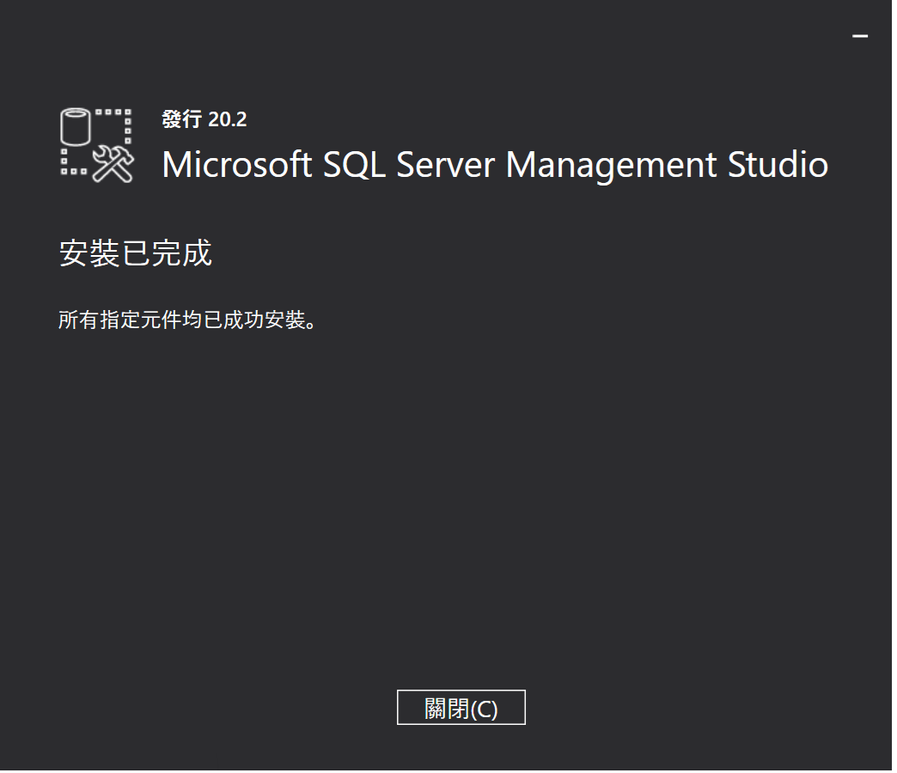

### run
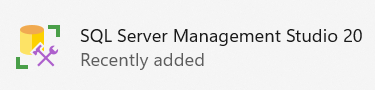

### login with windows
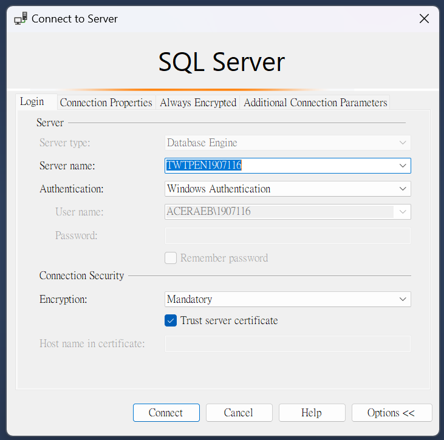

### set Server authentication : `SQL Server and Windows Authentication mode`

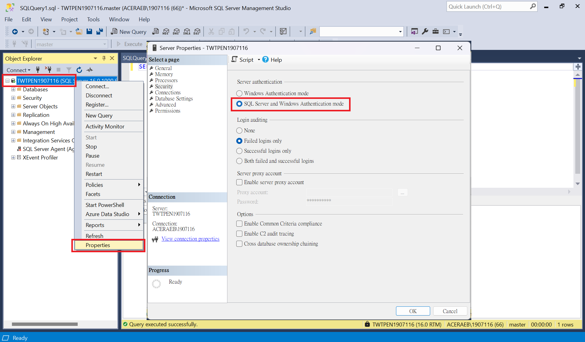

### restart
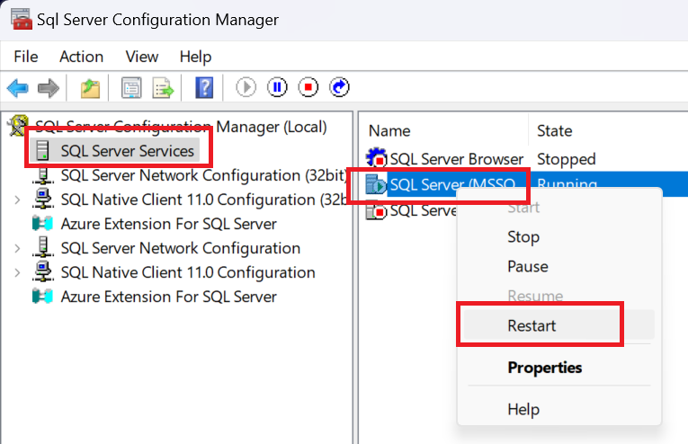

### login with
- Authentication: SQL Server Authentication
- Login: sa
- Password: ""
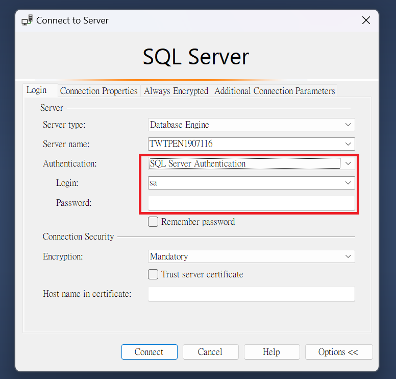 -->


## type orm, gen entities
## download / upload
## swagger
## auth
## calss-validation
## transaction
## email
## websocket
## third-party
